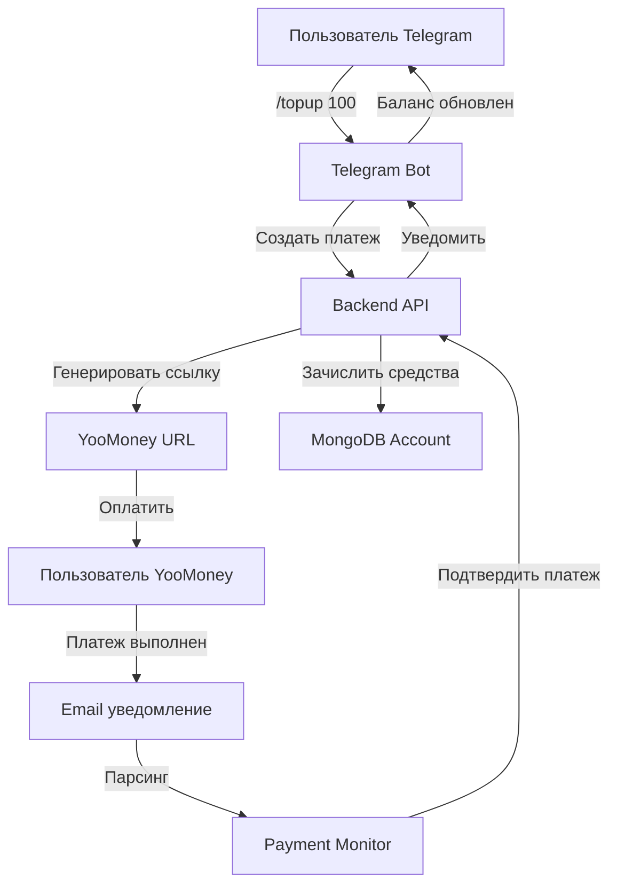

# Payment System Design Document - YooMoney Integration

## 📋 Введение и Цели

### Цель проекта
Создать систему оплаты для AI Stock Bot, позволяющую пользователям пополнять свой счет через YooMoney прямо из Telegram бота, без необходимости внешних платежных шлюзов.

### Почему именно YooMoney + Email мониторинг?
- **YooMoney** позволяет физическим лицам принимать платежи без регистрации ИП
- **Email мониторинг** решает проблему отсутствия webhook уведомлений у YooMoney для физлиц
- **Полная автоматизация** - пользователь получает зачисление средств без ручного вмешательства

## 🏗️ Архитектура системы

### Схема взаимодействия компонентов



### Компоненты системы

#### 1. **YooMoney Wallet** (Внешний сервис)
- **Назначение**: Прием платежей от пользователей
- **Тип**: Физическое лицо на yoomoney.ru
- **Функции**: Генерация платежных ссылок, обработка платежей

#### 2. **Telegram Bot** (tg-bot/)
- **Назначение**: Интерфейс пользователя для оплаты
- **Функции**:
  - Отображение текущего баланса
  - Создание платежных ссылок
  - Уведомление о зачислении средств

#### 3. **Payment Monitor** (payment-monitor/)
- **Назначение**: Автоматическое отслеживание поступивших платежей
- **Технология**: IMAP клиент для Gmail
- **Функции**:
  - Проверка новых email от YooMoney
  - Парсинг данных о платеже
  - Вызов webhook для подтверждения

#### 4. **Backend API** (backend/)
- **Назначение**: Центральная логика обработки платежей
- **Функции**:
  - Создание платежных записей
  - Управление балансом пользователей
  - Обработка webhook от Payment Monitor

#### 5. **MongoDB** (Database)
- **Коллекции**:
  - `payments` - записи о всех платежах
  - `accounts` - балансы пользователей
  - `transactions` - история операций

## 🎯 Поток данных при оплате

### Шаг 1: Инициация платежа
1. Пользователь в Telegram выбирает `/topup 100`
2. Bot отправляет запрос в Backend API
3. Backend создает запись в `payments` со статусом `pending`
4. Backend генерирует уникальный `label` для отслеживания
5. Backend возвращает YooMoney URL с параметрами

### Шаг 2: Процесс оплаты
1. Пользователь переходит по ссылке YooMoney
2. Выполняет оплату любым удобным способом
3. YooMoney отправляет email на указанный адрес

### Шаг 3: Обработка email
1. Payment Monitor каждые 30 секунд проверяет новые письма
2. При обнаружении письма от `noreply@yoomoney.ru`:
   - Парсит номер операции
   - Извлекает сумму и метку (label)
   - Отправляет данные в Backend webhook

### Шаг 4: Зачисление средств
1. Backend находит платеж по метке
2. Проверяет сумму и статус
3. Обновляет статус на `completed`
4. Зачисляет средства на баланс пользователя
5. Добавляет запись в историю транзакций
6. Уведомляет пользователя через Telegram

## 🔧 Техническая реализация

### 1. Генерация платежной ссылки

**Параметры YooMoney URL:**
```javascript
const paymentParams = {
  receiver: '410011234567890',        // Номер кошелька
  quickpay: 'shop',                   // Тип формы
  targets: 'Пополнение счета AI Bot', // Назначение платежа
  paymentType: 'SB',                  // Способ оплаты (Сбербанк)
  sum: 100,                          // Сумма
  label: 'ai_bot_12345_1699123456',  // Уникальный идентификатор
  successURL: 'https://t.me/your_bot' // URL после успешной оплаты
}
```

**Пример ссылки:**
```
https://yoomoney.ru/quickpay/confirm.xml?receiver=410011234567890&quickpay=shop&targets=Пополнение+счета+AI+Bot&paymentType=SB&sum=100&label=ai_bot_12345_1699123456
```

### 2. Парсинг email уведомлений

**Структура email от YooMoney:**
```
Тема: Платеж получен
От: noreply@yoomoney.ru

Платеж получен на кошелек 410011234567890
Сумма: 100.00 RUB
№ операции: 12345678901234567890
Метка: ai_bot_12345_1699123456
Дата: 01.01.2024 12:00:00
```

**Алгоритм парсинга:**
1. Проверка отправителя (`noreply@yoomoney.ru`)
2. Проверка темы (`Платеж получен`)
3. Извлечение суммы через регулярное выражение
4. Извлечение номера операции
5. Извлечение метки (label)

### 3. Безопасность транзакций

**Механизмы защиты:**
- **Уникальные метки**: Каждый платеж имеет уникальный label
- **Проверка суммы**: Сверка суммы из email с записью в БД
- **Однократная обработка**: Платеж обрабатывается только один раз
- **Логирование**: Все операции записываются в журнал
- **Rate limiting**: Ограничение на создание платежей

## 📊 Модели данных

### Payment Schema
```javascript
{
  _id: ObjectId,
  userId: ObjectId,           // Ссылка на пользователя
  externalId: String,         // Telegram ID
  amount: Number,            // Сумма в рублях
  currency: String,          // Всегда 'RUB'
  status: String,           // 'pending' | 'completed' | 'failed'
  yoomoneyOperationId: String, // ID операции в YooMoney
  yoomoneyLabel: String,    // Уникальный идентификатор
  emailNotification: Object, // Сырые данные из email
  createdAt: Date,          // Время создания
  completedAt: Date,        // Время завершения
  metadata: Object          // Дополнительные данные
}
```

### Account Schema
```javascript
{
  _id: ObjectId,
  userId: ObjectId,         // Ссылка на пользователя (уникальный)
  balance: Number,         // Текущий баланс в рублях
  currency: String,        // Всегда 'RUB'
  transactions: [{         // История операций
    type: String,         // 'credit' | 'debit'
    amount: Number,       // Сумма операции
    description: String,  // Описание
    paymentId: ObjectId,  // Ссылка на платеж
    createdAt: Date       // Время операции
  }],
  updatedAt: Date          // Время последнего обновления
}
```

## 🚀 Пошаговая инструкция по настройке

### Шаг 1: Регистрация YooMoney (15 минут)

1. **Создание аккаунта**
   - Перейдите на https://yoomoney.ru/
   - Нажмите "Зарегистрироваться"
   - Выберите способ: телефон или email
   - Подтвердите номер телефона

2. **Настройка кошелька**
   - Перейдите в "Настройки" → "Безопасность"
   - Включите двухфакторную аутентификацию
   - Заполните профиль (ФИО обязательно)

3. **Создание формы оплаты**
   - Перейдите в "Прием платежей" → "Форма оплаты"
   - Нажмите "Создать форму"
   - Заполните:
     - Название: "AI Stock Bot"
     - Описание: "Пополнение счета для генерации изображений"
     - Сумма: "Произвольная"
     - Валюта: "RUB"
     - Email уведомления: ваш email

### Шаг 2: Настройка Gmail (10 минут)

1. **Создание почты**
   - Создайте новый Gmail: `aistockbot.payments@gmail.com`
   - Включите двухфакторную аутентификацию

2. **App Password**
   - Google Account → Security → 2-Step Verification
   - App passwords → Generate
   - Выберите "Mail" → Скопируйте пароль

3. **Фильтры**
   - Settings → Filters and Blocked Addresses
   - Create new filter:
     - From: `noreply@yoomoney.ru`
     - Subject: `Платеж получен`
     - Create filter → Apply label "YooMoney-Payments"

### Шаг 3: Настройка переменных окружения

```bash
# Backend (.env)
YOOMONEY_WALLET=410011234567890
YOOMONEY_SHOP_ID=your_shop_id
YOOMONEY_SCID=your_scid
YOOMONEY_SECRET_KEY=your_secret_key

# Payment Monitor (.env)
GMAIL_USER=aistockbot.payments@gmail.com
GMAIL_APP_PASSWORD=your_app_password
BACKEND_URL=http://localhost:3000/api
CHECK_INTERVAL=30000
```

## 🔍 Архитектура обработки ошибок

### Типы ошибок и обработка

1. **Ошибка создания платежа**
   - Причина: Неверные параметры
   - Обработка: Telegram бот показывает сообщение об ошибке

2. **Ошибка email парсинга**
   - Причина: Изменился формат email
   - Обработка: Логирование, ручная проверка

3. **Ошибка зачисления средств**
   - Причина: Не найден платеж по метке
   - Обработка: Логирование, уведомление администратора

4. **Ошибка сети**
   - Причина: Недоступность сервисов
   - Обработка: Повторные попытки, backoff стратегия

### Мониторинг состояния

**Health checks:**
```bash
# Проверка Payment Monitor
curl http://localhost:3001/health

# Проверка email соединения
docker-compose logs payment-monitor | grep "Connected to Gmail"

# Проверка последних платежей
curl http://localhost:3000/api/payments?limit=5
```

## 📈 Масштабирование и будущее развитие

### Фаза 1: Базовая реализация (текущая)
- ✅ YooMoney для физлиц
- ✅ Email мониторинг
- ✅ Telegram интерфейс

### Фаза 2: Расширение возможностей
- Поддержка других платежных систем (ЮKassa, CloudPayments)
- Реферальная программа
- Автоматические скидки

### Фаза 3: Продвинутые функции
- Подписки с автоматическим продлением
- Групповые платежи
- Аналитика доходов

## 🛡️ Безопасность и соответствие

### Защита данных
- **Шифрование**: Все чувствительные данные шифруются в БД
- **Rate limiting**: Ограничение на количество платежей
- **Валидация**: Проверка всех входных данных
- **Логирование**: Полная история операций

### Соответствие требованиям
- **YooMoney TOS**: Соответствие условиям использования
- **GDPR**: Защита персональных данных
- **ФЗ-115**: Требования к идентификации пользователей

## 📞 Поддержка и устранение неполадок

### Быстрая диагностика

**Платеж не зачислен:**
1. Проверить логи Payment Monitor: `docker-compose logs payment-monitor`
2. Проверить email фильтры в Gmail
3. Проверить метку в платеже: `label` должен совпадать

**Ошибка подключения к Gmail:**
1. Проверить App Password
2. Убедиться, что IMAP включен
3. Проверить firewall

**Баланс не обновился:**
1. Проверить webhook endpoint
2. Проверить MongoDB connection
3. Проверить логи Backend API

### Контактная информация
- **Техническая поддержка**: support@aistockbot.ru
- **Emergency**: +7-XXX-XXX-XXXX
- **GitHub Issues**: https://github.com/alexanderrodnin/ai-stock-bot/issues
