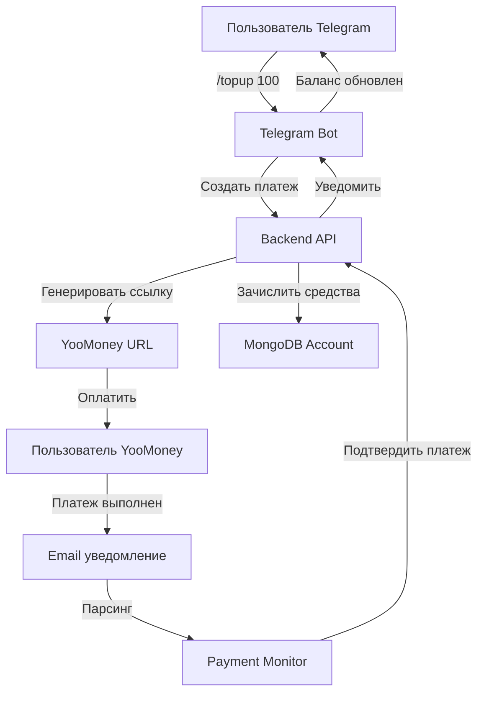

# Payment System Design Document - YooMoney Integration

## 📋 Введение и Цели

### Цель проекта
Создать систему оплаты для AI Stock Bot, позволяющую пользователям пополнять свой счет через YooMoney прямо из Telegram бота, без необходимости внешних платежных шлюзов.

### Почему именно YooMoney + Email мониторинг?
- **YooMoney** позволяет физическим лицам принимать платежи без регистрации ИП
- **Email мониторинг** решает проблему отсутствия webhook уведомлений у YooMoney для физлиц
- **Полная автоматизация** - пользователь получает зачисление средств без ручного вмешательства

## 🏗️ Архитектура системы

### Схема взаимодействия компонентов



### Компоненты системы

#### 1. **YooMoney Wallet** (Внешний сервис)
- **Назначение**: Прием платежей от пользователей
- **Тип**: Физическое лицо на yoomoney.ru
- **Функции**: Генерация платежных ссылок, обработка платежей

#### 2. **Telegram Bot** (tg-bot/)
- **Назначение**: Интерфейс пользователя для оплаты
- **Функции**:
  - Отображение текущего баланса
  - Создание платежных ссылок
  - Уведомление о зачислении средств

#### 3. **Payment Monitor** (payment-monitor/)
- **Назначение**: Автоматическое отслеживание поступивших платежей
- **Технология**: IMAP клиент для Gmail
- **Функции**:
  - Проверка новых email от YooMoney
  - Парсинг данных о платеже
  - Вызов webhook для подтверждения

#### 4. **Backend API** (backend/)
- **Назначение**: Центральная логика обработки платежей
- **Функции**:
  - Создание платежных записей
  - Управление балансом пользователей
  - Обработка webhook от Payment Monitor

#### 5. **MongoDB** (Database)
- **Коллекции**:
  - `payments` - записи о всех платежах
  - `accounts` - балансы пользователей
  - `transactions` - история операций

## 🎯 Поток данных при оплате

### Шаг 1: Инициация платежа
1. Пользователь в Telegram выбирает `/topup 100`
2. Bot отправляет запрос в Backend API
3. Backend создает запись в `payments` со статусом `pending`
4. Backend генерирует уникальный `label` для отслеживания
5. Backend возвращает YooMoney URL с параметрами

### Шаг 2: Процесс оплаты
1. Пользователь переходит по ссылке YooMoney
2. Выполняет оплату любым удобным способом
3. YooMoney отправляет email на указанный адрес

### Шаг 3: Обработка email
1. Payment Monitor каждые 30 секунд проверяет новые письма
2. При обнаружении письма от `noreply@yoomoney.ru`:
   - Парсит номер операции
   - Извлекает сумму и метку (label)
   - Отправляет данные в Backend webhook

### Шаг 4: Зачисление средств
1. Backend находит платеж по метке
2. Проверяет сумму и статус
3. Обновляет статус на `completed`
4. Зачисляет средства на баланс пользователя
5. Добавляет запись в историю транзакций
6. Уведомляет пользователя через Telegram

## 🔧 Техническая реализация

### 1. Генерация платежной ссылки

**Параметры YooMoney URL:**
```javascript
const paymentParams = {
  receiver: '410011234567890',        // Номер кошелька
  quickpay: 'shop',                   // Тип формы
  targets: 'Пополнение счета AI Bot', // Назначение платежа
  paymentType: 'SB',                  // Способ оплаты (Сбербанк)
  sum: 100,                          // Сумма
  label: 'ai_bot_12345_1699123456',  // Уникальный идентификатор
  successURL: 'https://t.me/your_bot' // URL после успешной оплаты
}
```

**Пример ссылки:**
```
https://yoomoney.ru/quickpay/confirm.xml?receiver=410011234567890&quickpay=shop&targets=Пополнение+счета+AI+Bot&paymentType=SB&sum=100&label=ai_bot_12345_1699123456
```

### 2. Парсинг email уведомлений

**Структура email от YooMoney:**
```
Тема: Платеж получен
От: noreply@yoomoney.ru

Платеж получен на кошелек 410011234567890
Сумма: 100.00 RUB
№ операции: 12345678901234567890
Метка: ai_bot_12345_1699123456
Дата: 01.01.2024 12:00:00
```

**Алгоритм парсинга:**
1. Проверка отправителя (`noreply@yoomoney.ru`)
2. Проверка темы (`Платеж получен`)
3. Извлечение суммы через регулярное выражение
4. Извлечение номера операции
5. Извлечение метки (label)

### 3. Безопасность транзакций

**Механизмы защиты:**
- **Уникальные метки**: Каждый платеж имеет уникальный label
- **Проверка суммы**: Сверка суммы из email с записью в БД
- **Однократная обработка**: Платеж обрабатывается только один раз
- **Логирование**: Все операции записываются в журнал
- **Rate limiting**: Ограничение на создание платежей

## 📊 Модели данных

### Payment Schema
```javascript
{
  _id: ObjectId,
  userId: ObjectId,           // Ссылка на пользователя
  externalId: String,         // Telegram ID
  amount: Number,            // Сумма в рублях
  currency: String,          // Всегда 'RUB'
  status: String,           // 'pending' | 'completed' | 'failed'
  yoomoneyOperationId: String, // ID операции в YooMoney
  yoomoneyLabel: String,    // Уникальный идентификатор
  emailNotification: Object, // Сырые данные из email
  createdAt: Date,          // Время создания
  completedAt: Date,        // Время завершения
  metadata: Object          // Дополнительные данные
}
```

### Account Schema
```javascript
{
  _id: ObjectId,
  userId: ObjectId,         // Ссылка на пользователя (уникальный)
  balance: Number,         // Текущий баланс в рублях
  currency: String,        // Всегда 'RUB'
  transactions: [{         // История операций
    type: String,         // 'credit' | 'debit'
    amount: Number,       // Сумма операции
    description: String,  // Описание
    paymentId: ObjectId,  // Ссылка на платеж
    createdAt: Date       // Время операции
  }],
  updatedAt: Date          // Время последнего обновления
}
```

## 🚀 Пошаговая инструкция по настройке

### Шаг 1: Регистрация YooMoney (15 минут)

1. **Создание аккаунта**
   - Перейдите на https://yoomoney.ru/
   - Нажмите "Зарегистрироваться"
   - Выберите способ: телефон или email
   - Подтвердите номер телефона

2. **Настройка кошелька**
   - Перейдите в "Настройки" → "Безопасность"
   - Включите двухфакторную аутентификацию
   - Заполните профиль (ФИО обязательно)

3. **Создание формы оплаты**
   - Перейдите в "Прием платежей" → "Форма оплаты"
   - Нажмите "Создать форму"
   - Укажите:
     - Название: "AI Stock Bot"
     - Описание: "Пополнение счета для генерации изображений"
     - Сумма: "Произвольная"
     - Валюта: "RUB"
     - Email уведомления: ваш email

### Шаг 2: Настройка Gmail для Payment Monitor (10 минут)

1. **Создание почты**
   - Создайте новый Gmail: `aistockbot.payments@gmail.com`
   - Включите двухфакторную аутентификацию

2. **App Password**
   - Google Account → Security → 2-Step Verification
   - App passwords → Generate
   - Выберите "Mail" → Скопируйте пароль

3. **Фильтры**
   - Settings → Filters and Blocked Addresses
   - Create new filter:
     - From: `noreply@yoomoney.ru`
     - Subject: `Платеж получен`
     - Create filter → Apply label "YooMoney-Payments"

### Шаг 3: Разработка Payment Monitor (30 минут)

#### 3.1 Создание нового сервиса
```bash
mkdir payment-monitor
cd payment-monitor
npm init -y
npm install imap dotenv axios node-cron
```

#### 3.2 Структура проекта
```
payment-monitor/
├── src/
│   ├── emailMonitor.js    # Мониторинг email
│   ├── paymentParser.js   # Парсинг платежей
│   ├── webhookService.js  # Отправка webhook
│   └── logger.js         # Логирование
├── .env
├── index.js
├── package.json
└── Dockerfile
```

#### 3.3 Основной код сервиса
```javascript
// index.js
const emailMonitor = require('./src/emailMonitor');
const logger = require('./src/logger');

async function start() {
  logger.info('Starting Payment Monitor...');
  await emailMonitor.start();
}

start().catch(error => {
  logger.error('Failed to start Payment Monitor:', error);
  process.exit(1);
});
```

#### 3.4 Конфигурация (.env)
```bash
# Gmail settings
GMAIL_USER=aistockbot.payments@gmail.com
GMAIL_APP_PASSWORD=your_app_password_here
GMAIL_HOST=imap.gmail.com
GMAIL_PORT=993

# Backend settings
BACKEND_URL=http://localhost:3000/api
BACKEND_WEBHOOK_SECRET=your_webhook_secret

# Monitor settings
CHECK_INTERVAL=30000
LOG_LEVEL=info
```

### Шаг 4: Изменения в Backend (45 минут)

#### 4.1 Новые модели MongoDB
```javascript
// backend/src/models/Payment.js
const mongoose = require('mongoose');

const paymentSchema = new mongoose.Schema({
  userId: { type: mongoose.Schema.Types.ObjectId, ref: 'User', required: true },
  externalId: { type: String, required: true },
  amount: { type: Number, required: true },
  currency: { type: String, default: 'RUB' },
  status: { 
    type: String, 
    enum: ['pending', 'completed', 'failed', 'expired'], 
    default: 'pending' 
  },
  yoomoneyOperationId: String,
  yoomoneyLabel: { type: String, unique: true, required: true },
  emailNotification: mongoose.Schema.Types.Mixed,
  metadata: mongoose.Schema.Types.Mixed,
  expiresAt: { type: Date, default: () => new Date(Date.now() + 24 * 60 * 60 * 1000) },
  createdAt: { type: Date, default: Date.now },
  completedAt: Date
});

paymentSchema.index({ yoomoneyLabel: 1 });
paymentSchema.index({ userId: 1, status: 1 });
paymentSchema.index({ createdAt: 1 });

module.exports = mongoose.model('Payment', paymentSchema);
```

```javascript
// backend/src/models/Account.js
const mongoose = require('mongoose');

const accountSchema = new mongoose.Schema({
  userId: { type: mongoose.Schema.Types.ObjectId, ref: 'User', unique: true, required: true },
  balance: { type: Number, default: 0, min: 0 },
  currency: { type: String, default: 'RUB' },
  transactions: [{
    type: { type: String, enum: ['credit', 'debit'], required: true },
    amount: { type: Number, required: true },
    description: String,
    paymentId: { type: mongoose.Schema.Types.ObjectId, ref: 'Payment' },
    metadata: mongoose.Schema.Types.Mixed,
    createdAt: { type: Date, default: Date.now }
  }],
  updatedAt: { type: Date, default: Date.now }
});

accountSchema.methods.addTransaction = function(type, amount, description, paymentId = null) {
  this.transactions.push({
    type,
    amount,
    description,
    paymentId,
    createdAt: new Date()
  });
  
  if (type === 'credit') {
    this.balance += amount;
  } else if (type === 'debit') {
    this.balance -= amount;
  }
  
  this.updatedAt = new Date();
  return this.save();
};

module.exports = mongoose.model('Account', accountSchema);
```

#### 4.2 Новые API endpoints
```javascript
// backend/src/routes/payments.js
const express = require('express');
const router = express.Router();
const paymentController = require('../controllers/paymentController');
const { authenticate } = require('../middleware/auth');

// Создание платежа
router.post('/create', authenticate, paymentController.createPayment);

// Webhook для Payment Monitor
router.post('/webhook', paymentController.handleWebhook);

// Получение истории платежей
router.get('/history', authenticate, paymentController.getPaymentHistory);

// Получение текущего баланса
router.get('/balance', authenticate, paymentController.getBalance);

module.exports = router;
```

#### 4.3 Сервисы
```javascript
// backend/src/services/paymentService.js
const Payment = require('../models/Payment');
const Account = require('../models/Account');
const User = require('../models/User');
const crypto = require('crypto');

class PaymentService {
  async createPayment(userId, amount) {
    const user = await User.findById(userId);
    if (!user) throw new Error('User not found');

    const label = `ai_bot_${userId}_${Date.now()}`;
    
    const payment = new Payment({
      userId,
      externalId: user.externalId,
      amount,
      yoomoneyLabel: label
    });

    await payment.save();
    
    return {
      paymentId: payment._id,
      yoomoneyUrl: this.generateYooMoneyUrl(label, amount),
      label
    };
  }

  async confirmPayment(label, operationId, amount) {
    const payment = await Payment.findOne({ yoomoneyLabel: label });
    if (!payment) throw new Error('Payment not found');

    if (payment.status !== 'pending') {
      throw new Error('Payment already processed');
    }

    if (payment.amount !== amount) {
      throw new Error('Amount mismatch');
    }

    payment.status = 'completed';
    payment.yoomoneyOperationId = operationId;
    payment.completedAt = new Date();
    await payment.save();

    // Зачисление средств на баланс
    let account = await Account.findOne({ userId: payment.userId });
    if (!account) {
      account = new Account({ userId: payment.userId });
    }

    await account.addTransaction('credit', amount, 'Пополнение счета', payment._id);
    
    return payment;
  }

  generateYooMoneyUrl(label, amount) {
    const params = new URLSearchParams({
      receiver: process.env.YOOMONEY_WALLET,
      quickpay: 'shop',
      targets: 'Пополнение счета AI Stock Bot',
      paymentType: 'SB',
      sum: amount.toString(),
      label: label,
      successURL: `https://t.me/${process.env.TELEGRAM_BOT_USERNAME}`
    });

    return `https://yoomoney.ru/quickpay/confirm.xml?${params.toString()}`;
  }

  async getPaymentHistory(userId, limit = 20, skip = 0) {
    return Payment.find({ userId })
      .sort({ createdAt: -1 })
      .limit(limit)
      .skip(skip);
  }

  async getBalance(userId) {
    let account = await Account.findOne({ userId });
    if (!account) {
      account = new Account({ userId, balance: 0 });
      await account.save();
    }
    return account;
  }
}

module.exports = new PaymentService();
```

### Шаг 5: Изменения в Telegram Bot (30 минут)

#### 5.1 Новые команды
```javascript
// tg-bot/services/paymentService.js
const axios = require('axios');

class PaymentService {
  constructor(backendUrl) {
    this.backendUrl = backendUrl;
  }

  async createPayment(userId, amount) {
    try {
      const response = await axios.post(`${this.backendUrl}/payments/create`, {
        amount: parseInt(amount)
      }, {
        headers: { 'X-User-Id': userId }
      });
      return response.data;
    } catch (error) {
      throw new Error(`Failed to create payment: ${error.message}`);
    }
  }

  async getBalance(userId) {
    try {
      const response = await axios.get(`${this.backendUrl}/payments/balance`, {
        headers: { 'X-User-Id': userId }
      });
      return response.data;
    } catch (error) {
      throw new Error(`Failed to get balance: ${error.message}`);
    }
  }

  async getPaymentHistory(userId, limit = 10) {
    try {
      const response = await axios.get(`${this.backendUrl}/payments/history?limit=${limit}`, {
        headers: { 'X-User-Id': userId }
      });
      return response.data;
    } catch (error) {
      throw new Error(`Failed to get payment history: ${error.message}`);
    }
  }
}

module.exports = PaymentService;
```

#### 5.2 Обработчики команд
```javascript
// tg-bot/index.js - добавление новых команд
const PaymentService = require('./services/paymentService');
const paymentService = new PaymentService(process.env.BACKEND_API_URL);

// Команда пополнения баланса
bot.onText(/\/topup(?:\s+(\d+))?/, async (msg, match) => {
  const chatId = msg.chat.id;
  const userId = msg.from.id;
  const amount = match[1];

  if (!amount || amount < 10 || amount > 10000) {
    return bot.sendMessage(chatId, 
      '❌ Укажите сумму от 10 до 10000 рублей\nПример: /topup 100');
  }

  try {
    const payment = await paymentService.createPayment(userId, amount);
    
    const keyboard = {
      inline_keyboard: [[
        { text: "💳 Оплатить", url: payment.yoomoneyUrl }
      ]]
    };

    await bot.sendMessage(chatId, 
      `💰 Пополнение счета на ${amount}₽\n\n` +
      `🔗 Нажмите кнопку ниже для оплаты:\n` +
      `⚡ После оплаты средства автоматически зачислятся на ваш счет`,
      { reply_markup: keyboard }
    );
  } catch (error) {
    bot.sendMessage(chatId, `❌ Ошибка: ${error.message}`);
  }
});

// Команда проверки баланса
bot.onText(/\/balance/, async (msg) => {
  const chatId = msg.chat.id;
  const userId = msg.from.id;

  try {
    const balance = await paymentService.getBalance(userId);
    bot.sendMessage(chatId, 
      `💰 Ваш баланс: ${balance.balance}₽\n\n` +
      `Для пополнения используйте: /topup [сумма]`
    );
  } catch (error) {
    bot.sendMessage(chatId, `❌ Ошибка: ${error.message}`);
  }
});

// Команда истории платежей
bot.onText(/\/history(?:\s+(\d+))?/, async (msg, match) => {
  const chatId = msg.chat.id;
  const userId = msg.from.id;
  const limit = match[1] || 5;

  try {
    const history = await paymentService.getPaymentHistory(userId, limit);
    
    if (history.data.payments.length === 0) {
      return bot.sendMessage(chatId, '📊 История платежей пуста');
    }

    let message = '📊 История платежей:\n\n';
    history.data.payments.forEach(payment => {
      const status = payment.status === 'completed' ? '✅' : '⏳';
      const date = new Date(payment.createdAt).toLocaleDateString('ru-RU');
      message += `${status} ${date} - ${payment.amount}₽\n`;
    });

    bot.sendMessage(chatId, message);
  } catch (error) {
    bot.sendMessage(chatId, `❌ Ошибка: ${error.message}`);
  }
});
```

### Шаг 6: Обновление деплоймента (15 минут)

#### 6.1 Docker Compose обновление
```yaml
# docker-compose.yml - добавление payment-monitor
version: '3.8'
services:
  payment-monitor:
    build: ./payment-monitor
    container_name: ai-stock-bot-payment-monitor
    environment:
      - GMAIL_USER=${GMAIL_USER}
      - GMAIL_APP_PASSWORD=${GMAIL_APP_PASSWORD}
      - BACKEND_URL=http://backend:3000/api
      - CHECK_INTERVAL=30000
      - LOG_LEVEL=info
    depends_on:
      - backend
    restart: unless-stopped
    networks:
      - ai-stock-bot-network

  backend:
    # ... существующая конфигурация
    environment:
      # ... существующие переменные
      - YOOMONEY_WALLET=${YOOMONEY_WALLET}
```

#### 6.2 Dockerfile для Payment Monitor
```dockerfile
# payment-monitor/Dockerfile
FROM node:18-alpine

WORKDIR /app

COPY package*.json ./
RUN npm ci --only=production

COPY . .

CMD ["node", "index.js"]
```

#### 6.3 Переменные окружения
```bash
# .env.prod - добавление новых переменных
# YooMoney settings
YOOMONEY_WALLET=410011234567890

# Gmail settings
GMAIL_USER=aistockbot.payments@gmail.com
GMAIL_APP_PASSWORD=your_app_password_here

# Payment Monitor settings
CHECK_INTERVAL=30000
```

#### 6.4 Перезапуск сервисов
```bash
# Пересборка и запуск с новым сервисом
docker-compose -f docker-compose-prod.yml --env-file .env.prod up -d --build

# Проверка логов
docker-compose logs -f payment-monitor
```

## 🔍 Архитектура обработки ошибок

### Типы ошибок и обработка

1. **Ошибка создания платежа**
   - Причина: Неверные параметры
   - Обработка: Telegram бот показывает сообщение об ошибке

2. **Ошибка email парсинга**
   - Причина: Изменился формат email
   - Обработка: Логирование, ручная проверка

3. **Ошибка зачисления средств**
   - Причина: Не найден платеж по метке
   - Обработка: Логирование, уведомление администратора

4. **Ошибка сети**
   - Причина: Недоступность сервисов
   - Обработка: Повторные попытки, backoff стратегия

### Мониторинг состояния

**Health checks:**
```bash
# Проверка Payment Monitor
curl http://localhost:3001/health

# Проверка email соединения
docker-compose logs payment-monitor | grep "Connected to Gmail"

# Проверка последних платежей
curl http://localhost:3000/api/payments?limit=5
```

## 🛡️ Безопасность и соответствие

### Защита данных
- **Шифрование**: Все чувствительные данные шифруются в БД
- **Rate limiting**: Ограничение на количество платежей
- **Валидация**: Проверка всех входных данных
- **Логирование**: Полная история операций

### Соответствие требованиям
- **YooMoney TOS**: Соответствие условиям использования
- **GDPR**: Защита персональных данных
- **ФЗ-115**: Требования к идентификации пользователей

## 📈 Масштабирование и будущее развитие

### Фаза 1: Базовая реализация (текущая)
- ✅ YooMoney для физлиц
- ✅ Email мониторинг
- ✅ Telegram интерфейс

### Фаза 2: Расширение возможностей
- Поддержка других платежных систем (ЮKassa, CloudPayments)
- Реферальная программа
- Автоматические скидки

### Фаза 3: Продвинутые функции
- Подписки с автоматическим продлением
- Групповые платежи
- Аналитика доходов

## 📞 Поддержка и устранение неполадок

### Быстрая диагностика

**Платеж не зачислен:**
1. Проверить логи Payment Monitor: `docker-compose logs payment-monitor`
2. Проверить email фильтры в Gmail
3. Проверить метку в платеже: `label` должен совпадать

**Ошибка подключения к Gmail:**
1. Проверить App Password
2. Убедиться, что IMAP включен
3. Проверить firewall

**Баланс не обновился:**
1. Проверить webhook endpoint
2. Проверить MongoDB connection
3. Проверить логи Backend API

### Контактная информация
- **Техническая поддержка**: support@aistockbot.ru
- **Emergency**: +7-XXX-XXX-XXXX
- **GitHub Issues**: https://github.com/alexanderrodnin/ai-stock-bot/issues
