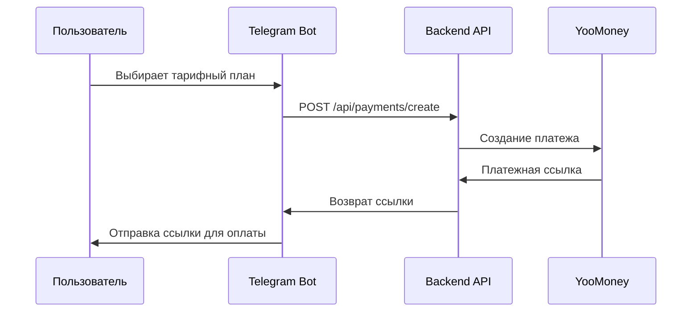
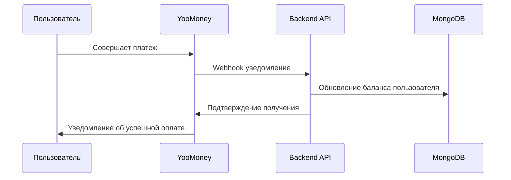

# Payment System Guide - YooMoney Integration

Руководство по интегрированной платежной системе YooMoney в AI Stock Bot, включая управление подписками, тарифными планами и обработку платежей.

## 📋 Обзор

AI Stock Bot интегрирован с платежной системой YooMoney для монетизации генерации изображений. Система поддерживает:

- **Подписочная модель**: Пользователи покупают пакеты изображений
- **Автоматическое списание**: Каждая генерация списывает 1 изображение с баланса
- **Webhook обработка**: Автоматическое пополнение баланса при успешной оплате
- **Тарифные планы**: Различные пакеты изображений с разными ценами
- **Audit trail**: Полное отслеживание всех транзакций

## 🔧 Настройка личного кабинета YooMoney

### Создание и верификация кошелька

Для начала работы необходимо зайти на официальный сайт YooMoney (https://yoomoney.ru/) и зарегистрировать новый кошелек.

В результате регистрации вы получите уникальный номер кошелька, состоящий из 16 цифр. Этот номер отображается на главной странице личного кабинета (важно: это именно номер кошелька, а не номер банковской карты) и потребуется для дальнейшей настройки системы.

Для полноценной работы с платежами необходимо пройти процедуру верификации. Перейдите в раздел "Настройки" → "Основной кошелек" → "Именной кошелек" и завершите верификацию минимум до уровня "Именной".

### Создание приложения

После успешной верификации необходимо зарегистрировать ваше приложение в системе YooMoney. Для этого перейдите по ссылке https://yoomoney.ru/myservices/new и заполните следующие поля:

- **"Название для пользователей"** - укажите понятное название вашего приложения
- **"Адрес сайта"** - введите URL вашего сайта или приложения
- **"Почта для связи"** - укажите контактный email адрес
- **"Redirect URI"** - URL для перенаправления пользователей после OAuth2 авторизации. Поскольку в данном проекте OAuth не используется, можно указать любой валидный URL
- **"Notification URI"** - адрес для получения уведомлений об операциях, инициированных приложением:
  - При наличии домена: `http(s)://yourdomain.com/api/payments/webhook`
  - При использовании IP-адреса: `http(s)://ip-address:port/api/payments/webhook`

По завершении регистрации вы получите **client_id**, который понадобится для настройки системы.

### Конфигурация HTTP-уведомлений

Завершающим этапом является настройка системы уведомлений. Перейдите в раздел настройки HTTP-уведомлений по адресу https://yoomoney.ru/transfer/myservices/http-notification?lang=ru и укажите endpoint для получения webhook-уведомлений:

- При наличии домена: `http(s)://yourdomain.com/api/payments/webhook`
- При использовании IP-адреса: `http(s)://ip-address:port/api/payments/webhook`

После настройки вы получите **секретный ключ для проверки подлинности**, который также потребуется для конфигурации системы.

## 🏗️ Архитектура платежной системы

### Компоненты, связанные с платежной системой

1. **Payment Service** (`backend/src/services/paymentService.js`)
   - Создание платежных ссылок YooMoney
   - Обработка webhook уведомлений
   - Управление балансом пользователей

2. **Payment Controller** (`backend/src/controllers/paymentController.js`)
   - REST API для создания платежей
   - Webhook endpoints для YooMoney
   - Получение тарифных планов

3. **Payment Routes** (`backend/src/routes/payments.js`)
   - Публичные endpoints для платежей
   - Webhook обработка
   - Статистика платежей

4. **User Model** (`backend/src/models/User.js`)
   - Хранение баланса изображений пользователя
   - История платежей и транзакций
   - Связь с Telegram ID

5. **Payment Model** (`backend/src/models/Payment.js`)
   - Хранение информации о платежах
   - Статусы и метаданные транзакций

6. **WebhookLog Model** (`backend/src/models/WebhookLog.js`)
   - Логирование всех webhook уведомлений
   - Отслеживание обработки платежей

*Полное описание архитектуры системы доступно в отдельной документации.*

## 🔧 Конфигурация YooMoney

### Переменные окружения

```bash
# YooMoney Configuration
YOOMONEY_SHOP_ID=your_shop_id_here
YOOMONEY_SECRET_KEY=your_secret_key_here
YOOMONEY_RETURN_URL=https://yourdomain.com/api/payments/success
YOOMONEY_NOTIFICATION_URL=https://yourdomain.com/api/payments/webhook
```

## 🔄 Поток платежа

### 1. Создание платежа



### 2. Обработка платежа



## 📡 API Endpoints

### Публичные endpoints

#### Получение тарифных планов
```http
GET /api/payments/plans
```

Ответ:
```json
{
  "success": true,
  "data": {
    "plans": [
      {
        "id": "basic",
        "name": "Базовый",
        "images": 25,
        "price": 199,
        "currency": "RUB",
        "description": "Популярный выбор",
        "popular": true,
        "pricePerImage": 7.96
      }
    ]
  }
}
```

#### Создание платежа
```http
POST /api/payments/create
Content-Type: application/json

{
  "telegramId": 123456789,
  "planId": "basic"
}
```

Ответ:
```json
{
  "success": true,
  "data": {
    "paymentUrl": "https://yoomoney.ru/checkout/payments/v2/contract?orderId=...",
    "orderId": "order_123456789_1640995200000",
    "amount": 199,
    "currency": "RUB",
    "description": "Покупка пакета: Базовый (25 изображений)"
  }
}
```

#### Webhook обработка
```http
POST /api/payments/webhook
Content-Type: application/x-www-form-urlencoded

notification_type=payment-succeeded&operation_id=...&amount=199.00&...
```

#### Проверка статуса платежа
```http
GET /api/payments/status/:orderId
```

#### Получение баланса пользователя
```http
GET /api/payments/balance/:telegramId
```

### Admin endpoints

#### Статистика платежей
```http
GET /api/admin/payments/stats
```

#### История платежей
```http
GET /api/admin/payments/history?limit=50&skip=0
```

#### Webhook логи
```http
GET /api/admin/webhooks/logs?limit=20
```

## 💳 Обработка платежей

### Типы webhook уведомлений

1. **payment-succeeded** - Успешная оплата
2. **payment-canceled** - Отмена платежа
3. **refund-succeeded** - Успешный возврат

### Валидация webhook

```javascript
const crypto = require('crypto');

function validateWebhook(body, signature, secretKey) {
  const hash = crypto
    .createHash('sha1')
    .update(body + secretKey)
    .digest('hex');
  
  return hash === signature;
}
```

### Обработка успешного платежа

```javascript
async function handleSuccessfulPayment(notification) {
  const { operation_id, amount, label } = notification;
  
  // Парсинг label для получения telegramId и planId
  const [telegramId, planId] = label.split('_');
  
  // Получение плана
  const plan = PRICING_PLANS.find(p => p.id === planId);
  
  // Обновление баланса пользователя
  await User.findOneAndUpdate(
    { telegramId },
    { 
      $inc: { imageBalance: plan.images },
      $push: { 
        paymentHistory: {
          orderId: operation_id,
          amount: parseFloat(amount),
          currency: 'RUB',
          planId,
          images: plan.images,
          status: 'completed',
          createdAt: new Date()
        }
      }
    }
  );
}
```

## 🔒 Безопасность

### Валидация webhook

- **Проверка подписи**: Все webhook проверяются на подлинность
- **IP фильтрация**: Только запросы с IP YooMoney принимаются
- **Дублирование**: Защита от повторной обработки одного платежа

### Защита от мошенничества

- **Уникальные order ID**: Каждый платеж имеет уникальный идентификатор
- **Временные метки**: Проверка актуальности уведомлений
- **Логирование**: Полное логирование всех операций

## 📊 Мониторинг и аналитика

### Ключевые метрики

```bash
# Общая статистика платежей
curl http://localhost:3000/api/admin/payments/stats

# Недавние платежи
curl "http://localhost:3000/api/admin/payments/recent?hours=24"

# Конверсия по тарифным планам
curl http://localhost:3000/api/admin/payments/conversion

# Webhook статистика
curl http://localhost:3000/api/admin/webhooks/stats
```

### Пример ответа статистики

```json
{
  "success": true,
  "data": {
    "totalRevenue": 15750,
    "totalPayments": 89,
    "averageOrderValue": 177,
    "conversionRate": 12.5,
    "planStats": {
      "basic": { "count": 45, "revenue": 8955 },
      "pro": { "count": 28, "revenue": 9772 },
      "starter": { "count": 16, "revenue": 1584 }
    },
    "recentPayments": 12,
    "failedPayments": 3
  }
}
```

## 📋 Руководство по миграции

При обновлении существующих установок:

1. **Миграция базы данных**: Новые коллекции будут созданы автоматически
2. **Переменные окружения**: Добавьте конфигурацию YooMoney
3. **Конфигурация по умолчанию**: Система создаст конфигурацию по умолчанию
4. **Существующие пользователи**: Legacy пользователи продолжат работать
5. **Совместимость API**: Существующий API продолжит работать

## 📞 Поддержка

### Контакты YooMoney

- **Техподдержка**: https://yoomoney.ru/support
- **Документация API**: https://yoomoney.ru/docs/
- **Статусы платежей**: https://status.yoomoney.ru/

### Внутренняя поддержка

При возникновении проблем:

1. Проверьте логи webhook обработки
2. Убедитесь в корректности конфигурации YooMoney
3. Проверьте статус платежа в личном кабинете YooMoney
4. Используйте debug endpoints для диагностики
5. Обратитесь к документации YooMoney API

Подробная документация по Admin API: [ADMIN_API_GUIDE.md](ADMIN_API_GUIDE.md)
