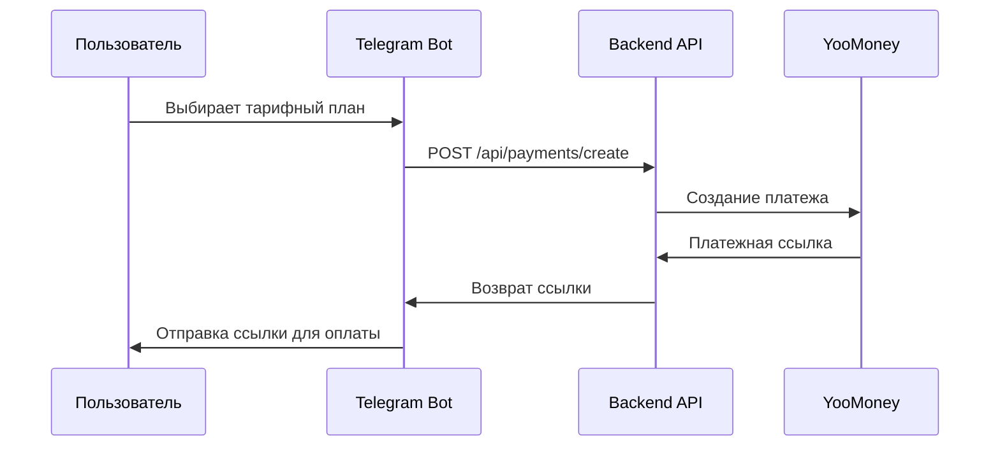
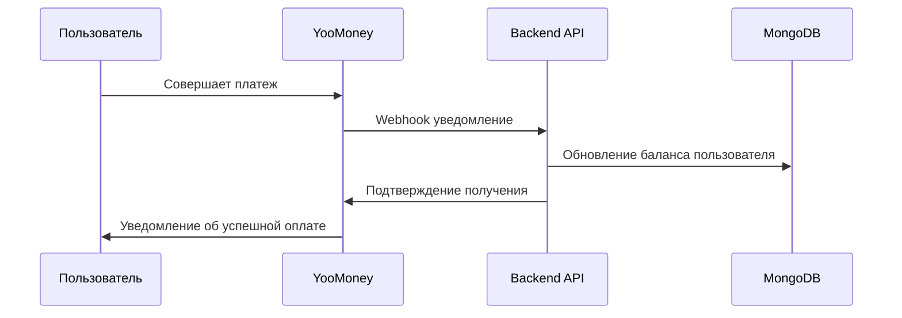

# Payment System Guide - YooMoney Integration

Руководство по интегрированной платежной системе YooMoney в AI Stock Bot, включая управление подписками, тарифными планами и обработку платежей.

## 📋 Обзор

AI Stock Bot интегрирован с платежной системой YooMoney для монетизации генерации изображений. Система поддерживает:

- **Подписочная модель**: Пользователи покупают пакеты изображений
- **Автоматическое списание**: Каждая генерация списывает 1 изображение с баланса
- **Webhook обработка**: Автоматическое пополнение баланса при успешной оплате
- **Тарифные планы**: Различные пакеты изображений с разными ценами
- **Audit trail**: Полное отслеживание всех транзакций

## 🏗️ Архитектура платежной системы

### Компоненты

1. **Payment Service** (`backend/src/services/paymentService.js`)
   - Создание платежных ссылок YooMoney
   - Обработка webhook уведомлений
   - Управление балансом пользователей

2. **User Model** (`backend/src/models/User.js`)
   - Хранение баланса изображений пользователя
   - История платежей и транзакций
   - Связь с Telegram ID

3. **Payment Controller** (`backend/src/controllers/paymentController.js`)
   - REST API для создания платежей
   - Webhook endpoints для YooMoney
   - Получение тарифных планов

4. **Payment Routes** (`backend/src/routes/payments.js`)
   - Публичные endpoints для платежей
   - Webhook обработка
   - Статистика платежей

## 💰 Тарифные планы

### Доступные пакеты изображений

```javascript
const PRICING_PLANS = [
  {
    id: 'starter',
    name: 'Стартовый',
    images: 10,
    price: 99,
    currency: 'RUB',
    description: 'Идеально для начинающих'
  },
  {
    id: 'basic',
    name: 'Базовый',
    images: 25,
    price: 199,
    currency: 'RUB',
    description: 'Популярный выбор',
    popular: true
  },
  {
    id: 'pro',
    name: 'Профессиональный',
    images: 50,
    price: 349,
    currency: 'RUB',
    description: 'Для активных пользователей'
  },
  {
    id: 'business',
    name: 'Бизнес',
    images: 100,
    price: 599,
    currency: 'RUB',
    description: 'Для коммерческого использования'
  },
  {
    id: 'enterprise',
    name: 'Корпоративный',
    images: 250,
    price: 1299,
    currency: 'RUB',
    description: 'Максимальная выгода'
  }
];
```

### Расчет стоимости за изображение

- **Стартовый**: 9.9 ₽ за изображение
- **Базовый**: 7.96 ₽ за изображение (скидка 20%)
- **Профессиональный**: 6.98 ₽ за изображение (скидка 30%)
- **Бизнес**: 5.99 ₽ за изображение (скидка 40%)
- **Корпоративный**: 5.20 ₽ за изображение (скидка 47%)

## 🔧 Конфигурация YooMoney

### Переменные окружения

```bash
# YooMoney Configuration
YOOMONEY_SHOP_ID=your_shop_id_here
YOOMONEY_SECRET_KEY=your_secret_key_here
YOOMONEY_RETURN_URL=https://yourdomain.com/api/payments/success
YOOMONEY_NOTIFICATION_URL=https://yourdomain.com/api/payments/webhook
```

### Настройка в личном кабинете YooMoney

1. **Создайте магазин** в YooMoney
2. **Получите Shop ID** и **Secret Key**
3. **Настройте HTTP уведомления**:
   - URL: `https://yourdomain.com/api/payments/webhook`
   - Метод: POST
   - Включите все типы уведомлений

4. **Настройте возвратные URL**:
   - Успешная оплата: `https://yourdomain.com/api/payments/success`
   - Отмена оплаты: `https://yourdomain.com/api/payments/cancel`

## 🔄 Поток платежа

### 1. Создание платежа



### 2. Обработка платежа



## 📡 API Endpoints

### Публичные endpoints

#### Получение тарифных планов
```http
GET /api/payments/plans
```

Ответ:
```json
{
  "success": true,
  "data": {
    "plans": [
      {
        "id": "basic",
        "name": "Базовый",
        "images": 25,
        "price": 199,
        "currency": "RUB",
        "description": "Популярный выбор",
        "popular": true,
        "pricePerImage": 7.96
      }
    ]
  }
}
```

#### Создание платежа
```http
POST /api/payments/create
Content-Type: application/json

{
  "telegramId": 123456789,
  "planId": "basic"
}
```

Ответ:
```json
{
  "success": true,
  "data": {
    "paymentUrl": "https://yoomoney.ru/checkout/payments/v2/contract?orderId=...",
    "orderId": "order_123456789_1640995200000",
    "amount": 199,
    "currency": "RUB",
    "description": "Покупка пакета: Базовый (25 изображений)"
  }
}
```

#### Webhook обработка
```http
POST /api/payments/webhook
Content-Type: application/x-www-form-urlencoded

notification_type=payment-succeeded&operation_id=...&amount=199.00&...
```

#### Проверка статуса платежа
```http
GET /api/payments/status/:orderId
```

#### Получение баланса пользователя
```http
GET /api/payments/balance/:telegramId
```

### Admin endpoints

#### Статистика платежей
```http
GET /api/admin/payments/stats
```

#### История платежей
```http
GET /api/admin/payments/history?limit=50&skip=0
```

#### Webhook логи
```http
GET /api/admin/webhooks/logs?limit=20
```

## 💳 Обработка платежей

### Типы webhook уведомлений

1. **payment-succeeded** - Успешная оплата
2. **payment-canceled** - Отмена платежа
3. **refund-succeeded** - Успешный возврат

### Валидация webhook

```javascript
const crypto = require('crypto');

function validateWebhook(body, signature, secretKey) {
  const hash = crypto
    .createHash('sha1')
    .update(body + secretKey)
    .digest('hex');
  
  return hash === signature;
}
```

### Обработка успешного платежа

```javascript
async function handleSuccessfulPayment(notification) {
  const { operation_id, amount, label } = notification;
  
  // Парсинг label для получения telegramId и planId
  const [telegramId, planId] = label.split('_');
  
  // Получение плана
  const plan = PRICING_PLANS.find(p => p.id === planId);
  
  // Обновление баланса пользователя
  await User.findOneAndUpdate(
    { telegramId },
    { 
      $inc: { imageBalance: plan.images },
      $push: { 
        paymentHistory: {
          orderId: operation_id,
          amount: parseFloat(amount),
          currency: 'RUB',
          planId,
          images: plan.images,
          status: 'completed',
          createdAt: new Date()
        }
      }
    }
  );
}
```

## 🔒 Безопасность

### Валидация webhook

- **Проверка подписи**: Все webhook проверяются на подлинность
- **IP фильтрация**: Только запросы с IP YooMoney принимаются
- **Дублирование**: Защита от повторной обработки одного платежа

### Защита от мошенничества

- **Уникальные order ID**: Каждый платеж имеет уникальный идентификатор
- **Временные метки**: Проверка актуальности уведомлений
- **Логирование**: Полное логирование всех операций

## 📊 Мониторинг и аналитика

### Ключевые метрики

```bash
# Общая статистика платежей
curl http://localhost:3000/api/admin/payments/stats

# Недавние платежи
curl "http://localhost:3000/api/admin/payments/recent?hours=24"

# Конверсия по тарифным планам
curl http://localhost:3000/api/admin/payments/conversion

# Webhook статистика
curl http://localhost:3000/api/admin/webhooks/stats
```

### Пример ответа статистики

```json
{
  "success": true,
  "data": {
    "totalRevenue": 15750,
    "totalPayments": 89,
    "averageOrderValue": 177,
    "conversionRate": 12.5,
    "planStats": {
      "basic": { "count": 45, "revenue": 8955 },
      "pro": { "count": 28, "revenue": 9772 },
      "starter": { "count": 16, "revenue": 1584 }
    },
    "recentPayments": 12,
    "failedPayments": 3
  }
}
```

## 🔧 Устранение неполадок

### Частые проблемы

1. **Webhook не приходят**
   - Проверьте URL в настройках YooMoney
   - Убедитесь, что сервер доступен извне
   - Проверьте логи на ошибки валидации

2. **Баланс не пополняется**
   - Проверьте обработку webhook в логах
   - Убедитесь в корректности telegramId
   - Проверьте статус платежа в YooMoney

3. **Ошибки создания платежа**
   - Проверьте API ключи YooMoney
   - Убедитесь в корректности суммы
   - Проверьте формат запроса

### Debug команды

```bash
# Проверка webhook логов
curl "http://localhost:3000/api/admin/webhooks/logs?limit=10"

# Проверка баланса пользователя
curl http://localhost:3000/api/payments/balance/123456789

# Проверка статуса платежа
curl http://localhost:3000/api/payments/status/order_123456789_1640995200000

# Принудительная проверка платежа
curl -X POST http://localhost:3000/api/admin/payments/verify \
  -H "Content-Type: application/json" \
  -d '{"orderId": "order_123456789_1640995200000"}'
```

## 🔮 Планы развития

### Запланированные улучшения

1. **Подписочная модель**: Ежемесячные подписки с автопродлением
2. **Промокоды**: Система скидок и промокодов
3. **Реферальная программа**: Бонусы за приглашение друзей
4. **Корпоративные тарифы**: Специальные условия для бизнеса
5. **Аналитика**: Расширенная аналитика платежей и конверсии
6. **A/B тестирование**: Тестирование различных тарифных планов
7. **Интеграция с другими платежными системами**: Stripe, PayPal, криптовалюты

### Технические улучшения

1. **Кэширование**: Redis для кэширования тарифных планов
2. **Очереди**: Bull/Agenda для обработки webhook
3. **Уведомления**: Email/SMS уведомления о платежах
4. **Backup**: Автоматическое резервное копирование транзакций
5. **Мониторинг**: Grafana/Prometheus для мониторинга платежей

## 📞 Поддержка

### Контакты YooMoney

- **Техподдержка**: https://yoomoney.ru/support
- **Документация API**: https://yoomoney.ru/docs/
- **Статусы платежей**: https://status.yoomoney.ru/

### Внутренняя поддержка

При возникновении проблем:

1. Проверьте логи webhook обработки
2. Убедитесь в корректности конфигурации YooMoney
3. Проверьте статус платежа в личном кабинете YooMoney
4. Используйте debug endpoints для диагностики
5. Обратитесь к документации YooMoney API

## 📋 Чек-лист для продакшена

### Перед запуском

- [ ] Настроен магазин в YooMoney
- [ ] Получены и настроены API ключи
- [ ] Настроены webhook URL
- [ ] Протестированы все тарифные планы
- [ ] Настроено логирование платежей
- [ ] Проверена валидация webhook
- [ ] Настроен мониторинг платежей
- [ ] Созданы backup процедуры

### После запуска

- [ ] Мониторинг поступления webhook
- [ ] Проверка корректности начисления баланса
- [ ] Анализ конверсии по тарифным планам
- [ ] Мониторинг ошибок платежей
- [ ] Регулярная проверка статистики

Подробная документация по Admin API: [ADMIN_API_GUIDE.md](ADMIN_API_GUIDE.md)
