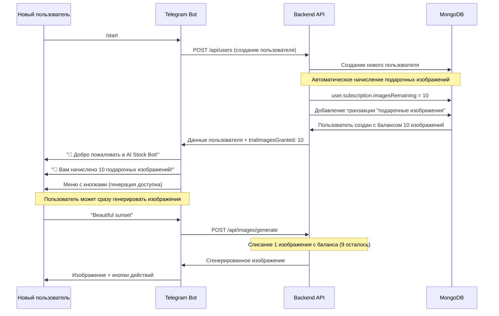
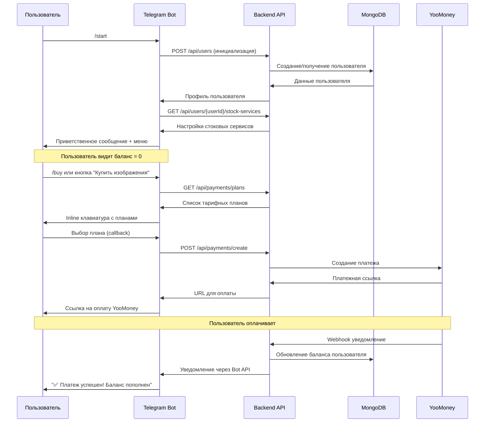
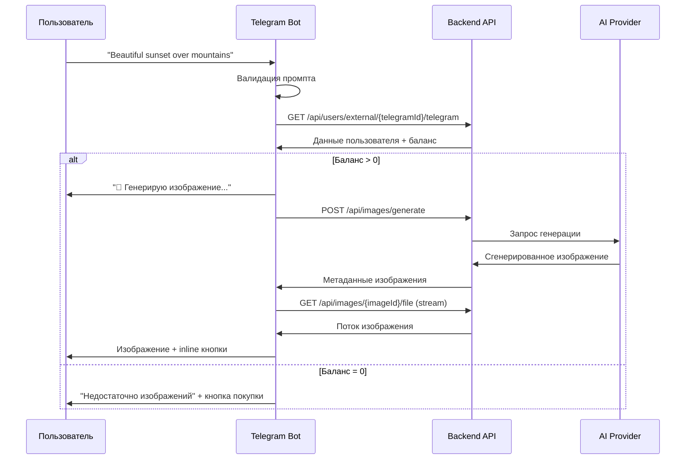
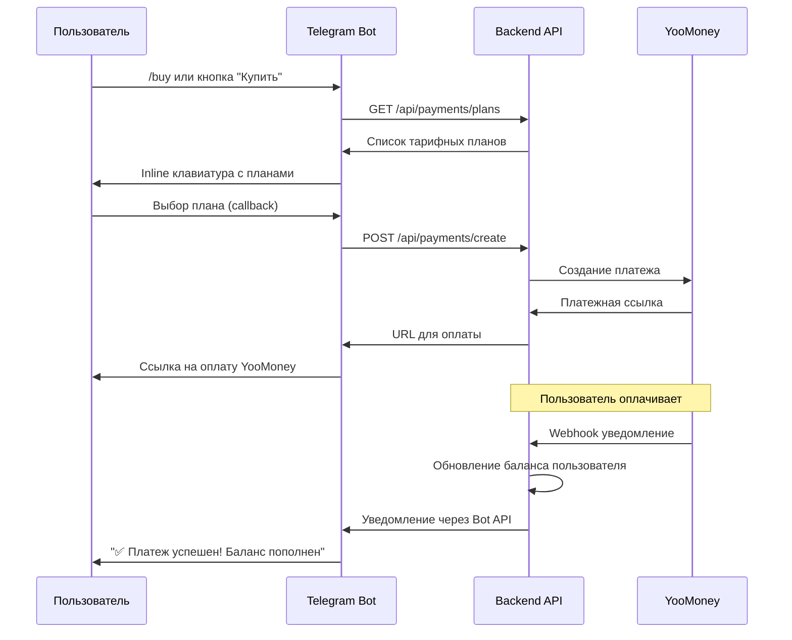
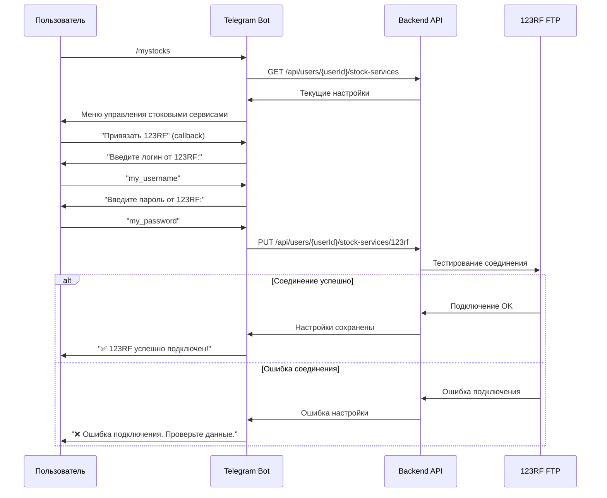
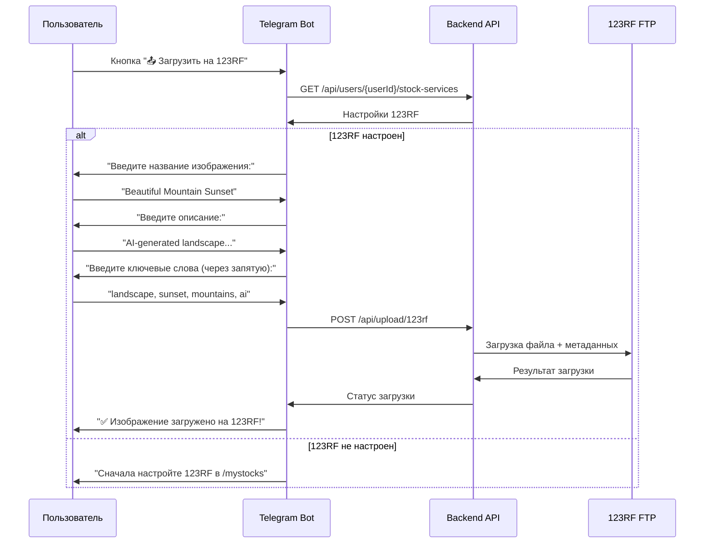
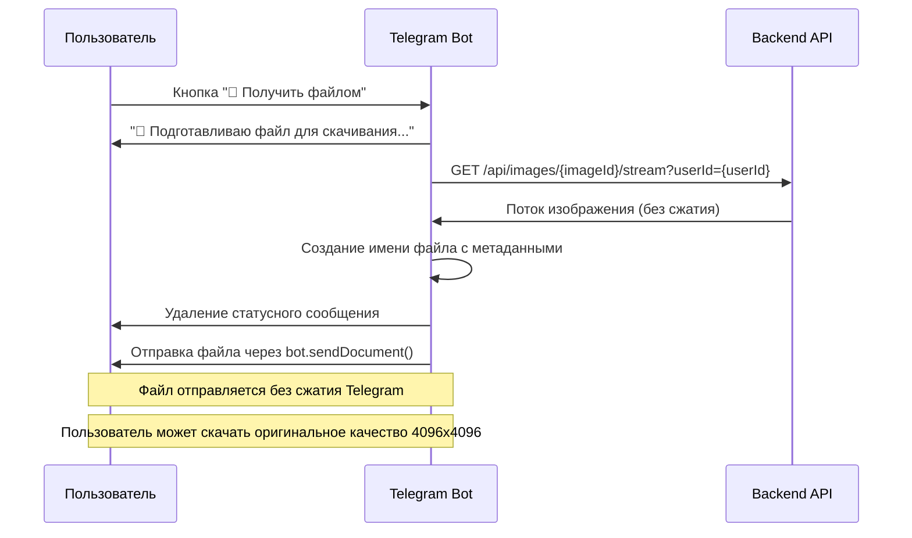

# AI Stock Bot - Telegram Bot

Telegram интерфейс для AI Stock Bot - системы генерации изображений с множественными AI моделями, интегрированной системой платежей YooMoney и автоматической загрузки на стоковые площадки.

## 📋 Содержание

- [Быстрый старт](#-быстрый-старт)
- [Архитектура Telegram Bot](#️-архитектура-telegram-bot)
- [Конфигурация](#-конфигурация)
- [Команды и функциональность](#-команды-и-функциональность)
- [Интеграция с Backend API](#-интеграция-с-backend-api)
- [Пользовательские сценарии](#-пользовательские-сценарии)
- [Безопасность и валидация](#-безопасность-и-валидация)
- [Мониторинг и логирование](#-мониторинг-и-логирование)
- [Docker Development](#-docker-development)
- [Тестирование](#-тестирование)
- [Поддержка](#-поддержка)

## 🚀 Быстрый старт

### Предварительные требования
- **Node.js** 18+ (рекомендуется 20+)
- **Telegram Bot Token** от [@BotFather](https://t.me/BotFather)
- **Запущенный Backend API** (см. [Backend README](../backend/README.md))
- Настроенные переменные окружения

### Создание Telegram бота

1. **Создайте бота через BotFather**:
   ```
   /start
   /newbot
   Введите название: AI Stock Bot
   Введите username: your_bot_name_bot
   ```

2. **Получите токен** и сохраните его в переменных окружения

3. **Настройте команды бота** (опционально):
   ```
   /setcommands
   start - Начать работу с ботом
   help - Справка по использованию
   balance - Проверить баланс изображений
   buy - Купить изображения
   mystocks - Настройки стоковых сервисов
   ```

### Установка и запуск

#### Через Docker (рекомендуется)
```bash
# Из корневой директории проекта
# Убедитесь, что backend уже запущен
docker-compose --profile backend up -d

# Запуск Telegram бота
docker-compose --profile bot up -d

# Или запуск всей системы сразу
docker-compose --profile backend --profile bot up -d
```

#### Локальная разработка
```bash
cd tg-bot
npm install
cp .env.example .env
# Настройте переменные окружения в .env
npm start
```

### Быстрая проверка
```bash
# Проверка логов бота
docker-compose logs tg-bot

# Проверка доступности Backend API
curl http://localhost:3000/api/health

# Тестирование в Telegram
# Найдите вашего бота и отправьте /start
```

## 🏗️ Архитектура Telegram Bot

### Структура проекта
```
tg-bot/
├── index.js                    # Основной файл бота и обработчики
├── services/
│   └── backendApiService.js    # HTTP клиент для Backend API
├── package.json                # NPM зависимости
├── .env.example               # Пример переменных окружения
├── Dockerfile                 # Docker образ для production
└── README.md                  # Документация бота
```

### Основные компоненты

#### **Main Bot Handler** (`index.js`)
- **Telegram Bot API**: Инициализация и управление ботом
- **Command Processing**: Обработка команд (/start, /help, /balance, etc.)
- **Message Handling**: Обработка текстовых сообщений как промптов
- **Callback Queries**: Обработка inline кнопок и меню
- **Session Management**: Управление многошаговыми диалогами
- **Error Handling**: Обработка ошибок и fallback режимы

#### **Backend API Service** (`services/backendApiService.js`)
- **HTTP Client**: Axios клиент для взаимодействия с Backend API
- **Stream Handling**: Потоковая передача изображений
- **Error Recovery**: Retry логика и обработка таймаутов
- **Demo Mode**: Fallback на демо изображения при недоступности API
- **Request Validation**: Валидация запросов перед отправкой

### Архитектурные принципы

#### **Event-Driven Architecture**
```javascript
// Обработка событий Telegram
bot.on('message', handleTextMessage);
bot.on('callback_query', handleCallbackQuery);
bot.on('polling_error', handlePollingError);
```

#### **Stateless Design**
- Каждый запрос независим
- Состояние хранится в Backend API
- Временные сессии для многошаговых операций

#### **Graceful Degradation**
- Demo режим при недоступности Backend
- Информативные сообщения об ошибках
- Автоматические повторы запросов

## 🔧 Конфигурация

### Переменные окружения

#### Обязательные переменные
```bash
# Telegram Bot Configuration
BOT_TOKEN=your_telegram_bot_token_from_botfather

# Backend API Integration
BACKEND_API_URL=http://backend:3000/api
```

#### Опциональные переменные
```bash
# Timeouts и производительность
BACKEND_API_TIMEOUT=120000          # Таймаут API запросов (2 минуты)
IMAGE_GENERATION_TIMEOUT=180000     # Таймаут генерации изображений (3 минуты)

# Режимы работы
DEMO_MODE=false                     # Демо режим с fallback изображениями
NODE_ENV=development                # Окружение (development/production)

# Логирование
LOG_LEVEL=info                      # Уровень логирования (debug/info/warn/error)

# Ограничения
MAX_PROMPT_LENGTH=1000              # Максимальная длина промпта
SESSION_TIMEOUT=300000              # Таймаут сессий (5 минут)
```

### Конфигурационные константы

#### Telegram API ограничения
```javascript
const TELEGRAM_LIMITS = {
  MESSAGE_LENGTH: 4096,           // Максимальная длина сообщения
  PHOTO_SIZE: 10 * 1024 * 1024,  // Максимальный размер фото (10MB)
  REQUESTS_PER_SECOND: 30,       // Лимит запросов в секунду
  REQUESTS_PER_MINUTE: 20        // Лимит для группы
};
```

#### Пользовательские ограничения
```javascript
const USER_LIMITS = {
  PROMPT_MAX_LENGTH: 1000,       // Максимальная длина промпта
  PROMPT_MIN_LENGTH: 3,          // Минимальная длина промпта
  SESSION_DURATION: 5 * 60 * 1000 // Время жизни сессии (5 минут)
};
```

## 📋 Команды и функциональность

### Основные команды

#### `/start` - Инициализация пользователя
- **Назначение**: Первый запуск бота, регистрация пользователя
- **Действия**: 
  - Создание/получение пользователя в Backend API
  - **Автоматическое начисление подарочных изображений** для новых пользователей
  - Проверка настроек стоковых сервисов
  - Отображение приветственного сообщения с уведомлением о подарке
  - Показ основного меню с доступными функциями

#### `/help` - Справочная информация
- **Назначение**: Помощь по использованию бота
- **Содержание**:
  - Список доступных команд
  - Инструкции по генерации изображений
  - Информация о тарифных планах
  - Ссылки на поддержку

#### `/balance` - Проверка баланса
- **Назначение**: Отображение текущего баланса изображений
- **Информация**:
  - Количество оставшихся изображений
  - История последних покупок
  - Кнопка для покупки дополнительных изображений

#### `/buy` - Покупка изображений
- **Назначение**: Покупка тарифных планов
- **Функциональность**:
  - Отображение доступных тарифов
  - Создание платежной ссылки YooMoney
  - Перенаправление на оплату
  - Уведомления об успешной оплате

#### `/mystocks` - Управление стоковыми сервисами
- **Назначение**: Настройка интеграции с 123RF
- **Возможности**:
  - Привязка учетной записи 123RF
  - Тестирование FTP соединения
  - Редактирование настроек
  - Отключение автозагрузки

### Интерактивные элементы

#### **Inline клавиатуры**
```javascript
// Меню после генерации изображения
const imageActionsKeyboard = {
  inline_keyboard: [
    [{ text: '📤 Загрузить на 123RF', callback_data: `upload_123rf_${imageId}` }],
    [{ text: '📁 Получить файлом', callback_data: `download_file_${imageId}` }],
    [{ text: '⚙️ Настройки стоков', callback_data: 'manage_stocks' }]
  ]
};

// Тарифные планы
const pricingKeyboard = {
  inline_keyboard: plans.map(plan => [{
    text: `${plan.name} - ${plan.images} изображений (${plan.price}₽)`,
    callback_data: JSON.stringify({
      action: 'buy_plan',
      planId: plan.id
    })
  }])
};
```

#### **Многошаговые диалоги**
```javascript
// Настройка 123RF
const stockConfigSteps = {
  'awaiting_123rf_username': 'Введите логин от 123RF:',
  'awaiting_123rf_password': 'Введите пароль от 123RF:',
  'awaiting_ftp_host': 'Введите FTP хост (или нажмите Пропустить):',
  'confirming_settings': 'Проверьте настройки и подтвердите:'
};
```

### Обработка текстовых сообщений

#### **Генерация изображений**
```javascript
// Валидация промпта
if (text.length < 3) {
  return bot.sendMessage(chatId, 'Описание слишком короткое. Минимум 3 символа.');
}

if (text.length > 1000) {
  return bot.sendMessage(chatId, 'Описание слишком длинное. Максимум 1000 символов.');
}

// Проверка баланса
const user = await backendApi.getUser(userId);
if (user.subscription.imagesRemaining <= 0) {
  return sendBalanceMessage(chatId);
}

// Генерация изображения
const loadingMessage = await bot.sendMessage(chatId, '🎨 Генерирую изображение...');
const image = await backendApi.generateImage(text, user.id, userId);
await bot.deleteMessage(chatId, loadingMessage.message_id);
await sendImageWithActions(chatId, image);
```

## 🎨 Автоматическая отправка изображений

### Обзор функциональности

**Автоматическая двойная отправка изображений** - оптимизированный пользовательский опыт, при котором после генерации изображения пользователь автоматически получает два сообщения:

#### Ключевые особенности
- **Первое сообщение**: Сжатое изображение с информацией о модели
- **Второе сообщение**: Файл без сжатия в оригинальном качестве 4096x4096
- **Автоматическое именование** файлов с метаданными (дата, промпт, ID)
- **Потоковая передача** для оптимальной производительности

### Пользовательский опыт

#### Последовательность отправки сообщений

1. **Первое сообщение - сжатое изображение**:
   ```
   🎨 Изображение сгенерировано!
   
   🤖 Модель: Juggernaut Pro Flux
   ```

2. **Второе сообщение - файл без сжатия**:
   ```
   📁 Файл изображения
   
   📝 Промт: Beautiful sunset over mountains
   📐 Размер: 4096x4096
   ```
   + Кнопка "📤 Загрузить на 123RF"

### Техническая реализация

#### Основная логика отправки
```javascript
// 1. Первое сообщение - сжатое изображение без кнопок
await bot.sendPhoto(chatId, imageStream, {
  caption: `🎨 Изображение сгенерировано!\n\n🤖 Модель: ${imageData.model}`,
  parse_mode: 'Markdown'
});

// 2. Второе сообщение - файл без сжатия + кнопка загрузки
const imageStreamForFile = await backendApi.getImageStream(imageData.id, user.id);
const filename = createFilename(imageData, prompt);

await bot.sendDocument(chatId, imageStreamForFile, {
  caption: `📁 Файл изображения\n\n📝 Промт: ${prompt}\n📐 Размер: 4096x4096`,
  parse_mode: 'Markdown',
  reply_markup: getUploadOnlyKeyboard(imageData.id, availableServices)
}, {
  filename: filename,
  contentType: 'image/jpeg'
});
```

#### Функция создания имени файла
```javascript
function createFilename(imageData, prompt) {
  const timestamp = new Date().toISOString().slice(0, 10); // YYYY-MM-DD
  const promptSnippet = prompt.substring(0, 30).replace(/[^a-zA-Z0-9]/g, '_');
  return `ai_image_${timestamp}_${promptSnippet}_${imageData.id.substring(0, 8)}.jpg`;
}
```

#### Упрощенная клавиатура
```javascript
function getUploadOnlyKeyboard(imageId, availableServices = []) {
  const keyboard = [];
  
  // Только кнопки загрузки на стоки
  if (availableServices.includes('123rf')) {
    keyboard.push([{ text: "📤 Загрузить на 123RF", callback_data: `upload_123rf_${imageId}` }]);
  }
  
  return { inline_keyboard: keyboard };
}
```

### Преимущества нового подхода

#### Для пользователей
- **Мгновенный доступ** к обоим вариантам изображения
- **Нет необходимости** нажимать дополнительные кнопки
- **Упрощенный интерфейс** с меньшим количеством кнопок
- **Оригинальное качество** всегда доступно без сжатия

#### Для системы
- **Автоматизация процесса** отправки файлов
- **Упрощение кода** за счет удаления обработчиков кнопок
- **Лучшая производительность** благодаря параллельной обработке
- **Меньше ошибок** из-за упрощения логики

## 🔄 Интеграция с Backend API

### API Endpoints используемые ботом

Telegram бот взаимодействует с Backend API через следующие endpoints:

#### **Пользователи** (подробнее в [Backend API Reference](../backend/README.md#users-api-apiusers))
```javascript
// Инициализация пользователя
POST /api/users
{
  externalId: telegramUserId,
  externalSystem: "telegram",
  profile: {
    username: telegramUsername,
    firstName: telegramFirstName,
    lastName: telegramLastName,
    language: telegramLanguageCode
  }
}

// Получение пользователя по Telegram ID
GET /api/users/external/{telegramUserId}/telegram

// Получение статистики пользователя
GET /api/users/{userId}/stats
```

#### **Генерация изображений** (подробнее в [AI Models Guide](../doc/AI_MODELS_GUIDE.md))
```javascript
// Генерация изображения
POST /api/images/generate
{
  prompt: "user prompt text",
  userId: userId,
  userExternalId: telegramUserId,
  userExternalSystem: "telegram",
  options: {
    model: "juggernaut-pro-flux"  // Используется активная модель
  }
}

// Получение изображения (потоковая передача)
GET /api/images/{imageId}/file?userId={userId}
```

#### **Платежная система** (подробнее в [Payment System Guide](../doc/PAYMENT_SYSTEM_GUIDE.md))
```javascript
// Получение тарифных планов
GET /api/payments/plans

// Создание платежа
POST /api/payments/create
{
  telegramId: telegramUserId,
  planId: "plan_100",
  returnUrl: "https://t.me/your_bot"
}

// Получение истории платежей
GET /api/payments/history/{userId}
```

#### **Стоковые сервисы**
```javascript
// Получение настроек стоковых сервисов
GET /api/users/{userId}/stock-services

// Обновление настроек 123RF
PUT /api/users/{userId}/stock-services/123rf
{
  enabled: true,
  credentials: {
    username: "123rf_username",
    password: "123rf_password"
  },
  settings: {
    ftpHost: "ftp.123rf.com",
    ftpPort: 21,
    remotePath: "/ai_images"
  }
}

// Загрузка изображения на 123RF
POST /api/upload/123rf
{
  imageId: imageId,
  userId: userId,
  title: "AI Generated Image",
  description: "Beautiful AI-generated artwork",
  keywords: ["ai", "generated", "art", "digital"],
  category: "Digital Art"
}
```

### Backend API Service

#### **HTTP Client Configuration**
```javascript
// services/backendApiService.js
const axios = require('axios');

const apiClient = axios.create({
  baseURL: process.env.BACKEND_API_URL,
  timeout: parseInt(process.env.BACKEND_API_TIMEOUT) || 120000,
  headers: {
    'Content-Type': 'application/json',
    'User-Agent': 'AI-Stock-Bot-Telegram/1.0'
  }
});

// Retry логика
apiClient.interceptors.response.use(
  response => response,
  async error => {
    if (error.response?.status >= 500 && error.config.retries < 3) {
      error.config.retries = (error.config.retries || 0) + 1;
      await new Promise(resolve => setTimeout(resolve, 1000 * error.config.retries));
      return apiClient.request(error.config);
    }
    return Promise.reject(error);
  }
);
```

#### **Потоковая передача изображений**
```javascript
async function getImageStream(imageId, userId) {
  try {
    const response = await apiClient.get(`/images/${imageId}/file`, {
      params: { userId },
      responseType: 'stream'
    });
    return response.data;
  } catch (error) {
    logger.error('Failed to get image stream', { imageId, userId, error: error.message });
    throw error;
  }
}
```

#### **Demo Mode Fallback**
```javascript
async function generateImage(prompt, userId, telegramUserId) {
  try {
    const response = await apiClient.post('/images/generate', {
      prompt,
      userId,
      userExternalId: telegramUserId,
      userExternalSystem: 'telegram'
    });
    return response.data.data;
  } catch (error) {
    if (process.env.DEMO_MODE === 'true') {
      logger.warn('API unavailable, using demo mode', { error: error.message });
      return getDemoImage(prompt);
    }
    throw error;
  }
}
```

## 🎁 Система подарочных изображений

### Обзор функциональности

**Система подарочных изображений** - это механизм привлечения новых пользователей, который автоматически начисляет бесплатные изображения при первом запуске бота.

#### Ключевые особенности
- **Автоматическое начисление** при первом запуске `/start`
- **Настраиваемое количество** через переменную окружения `TRIAL_IMAGES_COUNT`
- **Единоразовое начисление** - только для новых пользователей
- **Интеграция с балансом** - подарочные изображения работают как обычные
- **Уведомления пользователя** о получении подарка

### Техническая реализация

#### Логика начисления
```javascript
// При создании нового пользователя в Backend API
if (isNewUser) {
  const trialImagesCount = parseInt(process.env.TRIAL_IMAGES_COUNT) || 10;
  user.subscription.imagesRemaining = trialImagesCount;
  
  // Добавление транзакции в историю
  user.transactions.push({
    type: 'credit',
    amount: trialImagesCount,
    description: `Подарочные изображения при регистрации`,
    createdAt: new Date()
  });
}
```

#### Отображение в боте
```javascript
// Уведомление о подарочных изображениях
if (trialImagesGranted > 0) {
  await bot.sendMessage(chatId, 
    `🎁 Вам начислено ${trialImagesGranted} подарочных изображений!`
  );
}
```

### Пользовательский опыт

#### Сценарий получения подарка
1. **Пользователь запускает бота** командой `/start`
2. **Система проверяет** - новый ли это пользователь
3. **Автоматически начисляет** подарочные изображения
4. **Отправляет уведомление** о получении подарка
5. **Показывает меню** с доступными функциями

#### Сообщения пользователю
- **Приветственное сообщение**: Стандартное приветствие с информацией о боте
- **Уведомление о подарке**: `🎁 Вам начислено 10 подарочных изображений!`
- **Меню с кнопками**: Доступны все функции, включая генерацию изображений

### Конфигурация

#### Переменные окружения
```bash
# Количество подарочных изображений для новых пользователей
TRIAL_IMAGES_COUNT=10
```

#### Настройка в Backend
```javascript
// backend/src/config/config.js
module.exports = {
  trial: {
    imagesCount: parseInt(process.env.TRIAL_IMAGES_COUNT) || 10
  }
};
```

### Мониторинг и аналитика

#### Отслеживаемые метрики
- **Количество новых пользователей** получивших подарок
- **Конверсия** из подарочных изображений в платные планы
- **Использование подарочных изображений** (сколько потрачено)
- **Время до первой покупки** после использования подарка

#### Логирование
```javascript
// Логирование начисления подарочных изображений
logger.info('Trial images granted', {
  userId: user.id,
  telegramId: user.externalId,
  imagesGranted: trialImagesCount,
  timestamp: new Date().toISOString()
});
```

### Преимущества системы

#### Для пользователей
- **Бесплатное тестирование** функциональности бота
- **Понимание качества** генерируемых изображений
- **Изучение интерфейса** без финансовых затрат
- **Мотивация к покупке** после использования подарка

#### Для бизнеса
- **Увеличение конверсии** новых пользователей
- **Снижение барьера входа** для новых клиентов
- **Демонстрация ценности** продукта
- **Сбор данных** о поведении пользователей

## 🎯 Пользовательские сценарии

### 1. Первый запуск бота (с подарочными изображениями)


### 2. Первый запуск бота
### 2. Повторный запуск бота (существующий пользователь)


### 2. Генерация изображения


### 3. Покупка изображений


### 4. Настройка 123RF


### 5. Загрузка на стоковый сервис


### 6. Скачивание файла без сжатия


## 🔒 Безопасность и валидация

### Валидация входных данных

#### **Промпты для генерации**
```javascript
function validatePrompt(text) {
  // Проверка длины
  if (text.length < 3) {
    return { valid: false, error: 'Описание слишком короткое. Минимум 3 символа.' };
  }
  
  if (text.length > 1000) {
    return { valid: false, error: 'Описание слишком длинное. Максимум 1000 символов.' };
  }
  
  // Проверка на запрещенный контент
  const forbiddenWords = ['explicit', 'nsfw', 'adult'];
  const lowerText = text.toLowerCase();
  for (const word of forbiddenWords) {
    if (lowerText.includes(word)) {
      return { valid: false, error: 'Промпт содержит запрещенный контент.' };
    }
  }
  
  return { valid: true };
}
```

#### **Учетные данные стоковых сервисов**
```javascript
function validateStockCredentials(username, password) {
  // Валидация логина
  if (!username || username.length < 3) {
    return { valid: false, error: 'Логин должен содержать минимум 3 символа.' };
  }
  
  // Валидация пароля
  if (!password || password.length < 6) {
    return { valid: false, error: 'Пароль должен содержать минимум 6 символов.' };
  }
  
  // Проверка на специальные символы в логине
  if (!/^[a-zA-Z0-9_.-]+$/.test(username)) {
    return { valid: false, error: 'Логин может содержать только буквы, цифры, точки, дефисы и подчеркивания.' };
  }
  
  return { valid: true };
}
```

### Управление сессиями

#### **Многошаговые операции**
```javascript
// Хранение временных сессий
const userSessions = new Map();

// Структура сессии
function createSession(userId, step, data = {}) {
  return {
    userId,
    step,
    data,
    timestamp: Date.now(),
    expiresAt: Date.now() + (5 * 60 * 1000) // 5 минут
  };
}

// Автоматическая очистка истекших сессий
setInterval(() => {
  const now = Date.now();
  for (const [userId, session] of userSessions.entries()) {
    if (session.expiresAt < now) {
      userSessions.delete(userId);
      logger.debug('Session expired', { userId });
    }
  }
}, 60000); // Проверка каждую минуту
```

#### **Защита от спама**
```javascript
// Rate limiting для пользователей
const userLastAction = new Map();
const RATE_LIMIT_DELAY = 2000; // 2 секунды между запросами

function checkRateLimit(userId) {
  const lastAction = userLastAction.get(userId);
  const now = Date.now();
  
  if (lastAction && (now - lastAction) < RATE_LIMIT_DELAY) {
    return false;
  }
  
  userLastAction.set(userId, now);
  return true;
}
```

### Обработка ошибок и безопасность

#### **Санитизация данных**
```javascript
function sanitizeInput(text) {
  return text
    .trim()
    .replace(/[<>]/g, '') // Удаление HTML тегов
    .substring(0, 1000);  // Ограничение длины
}
```

#### **Безопасное логирование**
```javascript
function logUserAction(action, userId, data = {}) {
  // Удаление чувствительных данных из логов
  const sanitizedData = { ...data };
  delete sanitizedData.password;
  delete sanitizedData.token;
  
  logger.info('User action', {
    action,
    userId: userId.toString(), // Конвертация в строку
    data: sanitizedData,
    timestamp: new Date().toISOString()
  });
}
```

## 📊 Мониторинг и логирование

### Структурированное логирование

#### **Winston Logger Configuration**
```javascript
const winston = require('winston');

const logger = winston.createLogger({
  level: process.env.LOG_LEVEL || 'info',
  format: winston.format.combine(
    winston.format.timestamp(),
    winston.format.errors({ stack: true }),
    winston.format.json()
  ),
  transports: [
    new winston.transports.Console({
      format: winston.format.combine(
        winston.format.colorize(),
        winston.format.simple()
      )
    }),
    new winston.transports.File({ 
      filename: 'logs/error.log', 
      level: 'error' 
    }),
    new winston.transports.File({ 
      filename: 'logs/combined.log' 
    })
  ]
});
```

#### **Логируемые события**
```javascript
// Действия пользователей
logger.info('User message received', {
  userId: msg.from.id,
  username: msg.from.username,
  messageType: msg.text ? 'text' : 'other',
  promptLength: msg.text?.length,
  timestamp: new Date().toISOString()
});

// API взаимодействия
logger.info('Backend API request', {
  endpoint: '/api/images/generate',
  userId: userId,
  method: 'POST',
  responseTime: Date.now() - startTime
});

// Ошибки
logger.error('Image generation failed', {
  userId: userId,
  prompt: prompt.substring(0, 100),
  error: error.message,
  stack: error.stack
});

// Платежи
logger.info('Payment created', {
  userId: userId,
  planId: planId,
  amount: plan.price,
  paymentId: payment.paymentId
});
```

### Health Check и мониторинг

#### **Backend API Health Check**
```javascript
async function checkBackendHealth() {
  try {
    const response = await backendApi.get('/health', { timeout: 5000 });
    const isHealthy = response.status === 200;
    
    logger.debug('Backend health check', {
      status: response.status,
      healthy: isHealthy,
      responseTime: response.headers['x-response-time']
    });
    
    return isHealthy;
  } catch (error) {
    logger.warn('Backend API unavailable', {
      error: error.message,
      code: error.code
    });
    return false;
  }
}

// Периодическая проверка
setInterval(async () => {
  const isHealthy = await checkBackendHealth();
  if (!isHealthy && process.env.DEMO_MODE !== 'true') {
    logger.error('Backend API is down and demo mode is disabled');
  }
}, 60000); // Каждую минуту
```

#### **Метрики производительности**
```javascript
// Счетчики событий
const metrics = {
  messagesProcessed: 0,
  imagesGenerated: 0,
  paymentsCreated: 0,
  errorsOccurred: 0,
  apiRequestsTotal: 0,
  apiRequestsFailed: 0
};

// Обновление метрик
function updateMetrics(event, success = true) {
  metrics[event] = (metrics[event] || 0) + 1;
  if (!success) {
    metrics.errorsOccurred++;
  }
}

// Периодический вывод метрик
setInterval(() => {
  logger.info('Bot metrics', {
    messagesProcessed: metrics.messagesProcessed,
    imagesGenerated: metrics.imagesGenerated,
    paymentsCreated: metrics.paymentsCreated,
    errorsOccurred: metrics.errorsOccurred,
    successRate: (metrics.apiRequestsTotal - metrics.apiRequestsFailed) / metrics.apiRequestsTotal,
    timestamp: new Date().toISOString()
  });
}, 300000); // Каждые 5 минут
```

### Алерты и уведомления

#### **Критические ошибки**
```javascript
async function sendCriticalAlert(error, context = {}) {
  logger.error('Critical error occurred', {
    error: error.message,
    stack: error.stack,
    context,
    timestamp: new Date().toISOString()
  });
  
  // Отправка уведомления администратору (если настроено)
  if (process.env.ADMIN_CHAT_ID) {
    try {
      await bot.sendMessage(process.env.ADMIN_CHAT_ID, 
        `🚨 Критическая ошибка в боте:\n\n${error.message}\n\nВремя: ${new Date().toLocaleString()}`
      );
    } catch (alertError) {
      logger.error('Failed to send admin alert', { error: alertError.message });
    }
  }
}

// Обработка необработанных исключений
process.on('uncaughtException', (error) => {
  sendCriticalAlert(error, { type: 'uncaughtException' });
  process.exit(1);
});

process.on('unhandledRejection', (reason, promise) => {
  sendCriticalAlert(new Error(reason), { type: 'unhandledRejection', promise });
});
```

## 🐳 Docker Development

### Docker конфигурация

#### **Dockerfile**
```dockerfile
# Multi-stage build для оптимизации размера образа
FROM node:18-alpine AS base
WORKDIR /app
COPY package*.json ./

# Development stage
FROM base AS development
RUN npm ci
COPY . .
EXPOSE 3001
CMD ["npm", "run", "dev"]

# Production stage
FROM base AS production
RUN npm ci --only=production && npm cache clean --force
COPY . .
USER node
CMD ["npm", "start"]
```

#### **Docker Compose интеграция**
```yaml
# Из корневого docker-compose.yml
tg-bot:
  build:
    context: ./tg-bot
    dockerfile: Dockerfile
    target: development
  environment:
    - NODE_ENV=development
    - BOT_TOKEN=${BOT_TOKEN}
    - BACKEND_API_URL=http://backend:3000/api
    - DEMO_MODE=false
  volumes:
    - ./tg-bot:/app
    - /app/node_modules
  depends_on:
    - backend
  networks:
    - ai-stock-bot-network
  profiles:
    - bot
  restart: unless-stopped
```

### Docker команды для разработки

#### **Основные команды**
```bash
# Запуск только бота (требует запущенный backend)
docker-compose --profile bot up -d

# Запуск всей системы (backend + bot)
docker-compose --profile backend --profile bot up -d

# Просмотр логов бота
docker-compose logs -f tg-bot

# Перезапуск бота
docker-compose restart tg-bot

# Остановка бота
docker-compose stop tg-bot

# Пересборка образа бота
docker-compose build tg-bot
```

#### **Отладка и разработка**
```bash
# Подключение к контейнеру бота
docker-compose exec tg-bot sh

# Просмотр переменных окружения
docker-compose exec tg-bot env

# Проверка процессов в контейнере
docker-compose exec tg-bot ps aux

# Просмотр логов с фильтрацией
docker-compose logs tg-bot | grep ERROR
```

### Особенности Docker конфигурации

#### **Volumes и персистентность**
- **Hot reload**: Код монтируется для live обновлений в development
- **node_modules**: Исключены из монтирования для производительности
- **Логи**: Выводятся в stdout для Docker logs

#### **Сетевое взаимодействие**
- **Внутренняя сеть**: Бот общается с backend через Docker network
- **DNS resolution**: Использует имя сервиса `backend` для подключения
- **Изоляция**: Бот не имеет прямого доступа к MongoDB

#### **Environment Variables**
```bash
# Обязательные для Docker
BOT_TOKEN=your_bot_token
BACKEND_API_URL=http://backend:3000/api

# Опциональные
DEMO_MODE=false
LOG_LEVEL=info
ADMIN_CHAT_ID=123456789  # Для критических уведомлений
```

## 📞 Поддержка

### Полезные ссылки

#### **Документация системы**
- **Backend API**: [../backend/README.md](../backend/README.md) - Полная документация Backend API
- **AI Models**: [../doc/AI_MODELS_GUIDE.md](../doc/AI_MODELS_GUIDE.md) - Руководство по AI моделям
- **Payment System**: [../doc/PAYMENT_SYSTEM_GUIDE.md](../doc/PAYMENT_SYSTEM_GUIDE.md) - Платежная система YooMoney
- **Database**: [../doc/DATABASE_GUIDE.md](../doc/DATABASE_GUIDE.md) - Структура базы данных
- **Admin API**: [../doc/ADMIN_API_GUIDE.md](../doc/ADMIN_API_GUIDE.md) - Административный API
- **Production**: [../doc/PRODUCTION.md](../doc/PRODUCTION.md) - Развертывание в продакшене

#### **Внешние ресурсы**
- **Telegram Bot API**: [https://core.telegram.org/bots/api](https://core.telegram.org/bots/api)
- **BotFather**: [https://t.me/BotFather](https://t.me/BotFather) - Создание и управление ботами
- **YooMoney API**: [https://yoomoney.ru/docs/](https://yoomoney.ru/docs/) - Документация платежной системы
- **123RF API**: [https://www.123rf.com/api/](https://www.123rf.com/api/) - Документация стокового сервиса

#### **Контакты и поддержка**
- **GitHub Issues**: [https://github.com/alexanderrodnin/ai-stock-bot/issues](https://github.com/alexanderrodnin/ai-stock-bot/issues)
- **Документация проекта**: [https://github.com/alexanderrodnin/ai-stock-bot/tree/main/doc](https://github.com/alexanderrodnin/ai-stock-bot/tree/main/doc)

### Мониторинг и алерты

#### **Настройка уведомлений администратора**
```javascript
// Отправка статистики администратору
async function sendDailyReport() {
  if (!process.env.ADMIN_CHAT_ID) return;
  
  const report = `📊 Ежедневный отчет AI Stock Bot

🔢 Статистика за сутки:
• Сообщений обработано: ${metrics.messagesProcessed}
• Изображений сгенерировано: ${metrics.imagesGenerated}
• Платежей создано: ${metrics.paymentsCreated}
• Ошибок: ${metrics.errorsOccurred}

⚡ Производительность:
• Успешность API запросов: ${((metrics.apiRequestsTotal - metrics.apiRequestsFailed) / metrics.apiRequestsTotal * 100).toFixed(1)}%
• Активных сессий: ${userSessions.size}

🕐 Время: ${new Date().toLocaleString('ru-RU')}`;

  try {
    await bot.sendMessage(process.env.ADMIN_CHAT_ID, report);
  } catch (error) {
    logger.error('Failed to send daily report', { error: error.message });
  }
}

// Отправка отчета каждый день в 9:00
const cron = require('node-cron');
cron.schedule('0 9 * * *', sendDailyReport);
```

---

## 🎯 Заключение

**AI Stock Bot Telegram Interface** представляет собой полнофункциональный Telegram бот для взаимодействия с системой генерации изображений. Бот обеспечивает:

### ✅ Ключевые возможности
- **Интуитивный интерфейс** для генерации изображений через текстовые промпты
- **Интегрированная платежная система** с поддержкой YooMoney
- **Автоматическая загрузка** на стоковые сервисы (123RF)
- **Многошаговые диалоги** для настройки сложных параметров
- **Graceful degradation** с demo режимом при недоступности backend

### 🔧 Техническая надежность
- **Retry логика** для устойчивости к сбоям
- **Структурированное логирование** для мониторинга
- **Rate limiting** для защиты от спама
- **Валидация данных** на всех уровнях
- **Docker контейнеризация** для простого развертывания

### 📈 Масштабируемость
- **Stateless архитектура** для горизонтального масштабирования
- **Асинхронная обработка** для высокой производительности
- **Модульная структура** для легкого расширения функциональности
- **Comprehensive мониторинг** для отслеживания производительности

Бот готов к использованию в продакшене и может обслуживать большое количество пользователей одновременно, обеспечивая стабильную работу и отличный пользовательский опыт.
